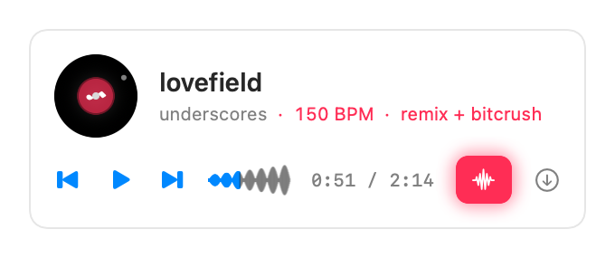

# Bitcrush&lt;3

**A macOS menu-bar app that turns Apple Music into a nightcore DJ.**

Grab whatever's playing in Apple Music, and Bitcrush&lt;3 re-sources it in the highest
quality, nightcores it, and beatmatch-crossfades from track to track on its own — a
little auto-DJ that lives in your menu bar.



---

## What it does

- **Grab from Apple Music** — reads the song playing in the Music app and re-sources it
  from YouTube (Apple Music's audio is DRM-locked, so it matches by title/artist) at the
  best available quality.
- **Nightcore it** — speeds up + pitches up with de-essing, loudness normalization, and a
  brick-wall limiter so it stays clean and loud, never harsh or clipped. Daycore and
  slowed + reverb presets too.
- **Bitcrush** — one-tap lo-fi crunch on the high "fringe" of the track (vocal body stays
  clean), gated so it sits in the mix instead of pumping.
- **Vocal flip** — one-tap male→female vocal transform (Little AlterBoy-style: pitch and
  formants shifted *independently*, so it reads feminine instead of chipmunk). Auto-gated:
  the button only engages on tracks whose vocals detect as male (Option-click to force).
  Needs `brew install rubberband`; with `demucs` + Praat installed you also get a
  stem-based max-quality engine and much more reliable vocal detection.
- **Beatmatched automix** — when you let the queue keep playing, it detects each track's
  BPM, phase-aligns the next one, and crossfades with a bass-swap ~8 bars before the end —
  bending the *outgoing* track to lock the beat so the incoming one always plays at speed.
  Falls back to a clean crossfade when two tempos are too far apart.
- **Reads as a deck** — a compact now-playing strip: spinning platter, live BPM + vibe,
  scrubbable waveform, transport, and the Bitcrush button.
- **Now Playing + media keys** — controllable from Control Center and your keyboard; the
  timeline reflects the remixed (sped-up) duration.
- **Discord Rich Presence** — optionally shows the track + vibe on your Discord profile.
- **Export** — save any remix as MP3 / FLAC / WAV / Opus.

It runs entirely on your Mac, so it uses your residential IP (no YouTube bot-blocking) and
your local `yt-dlp` / `ffmpeg` — nothing to deploy.

## Requirements

- macOS 14 (Sonoma) or later
- [`yt-dlp`](https://github.com/yt-dlp/yt-dlp) and [`ffmpeg`](https://ffmpeg.org/)
- [Bun](https://bun.sh) — yt-dlp needs a JavaScript runtime for full YouTube support, and
  Bitcrush&lt;3 points it at Bun

```sh
brew install yt-dlp ffmpeg
brew install oven-sh/bun/bun   # or: curl -fsSL https://bun.sh/install | bash
```

Optional, for the **vocal flip**:

```sh
brew install rubberband                        # the baseline flip engine
brew install --cask praat                      # + demucs: stem engine & reliable detection
uv tool install --python 3.12 --with torchcodec demucs
```

## Build & install

```sh
git clone https://github.com/rayhanadev/bitcrush.git
cd bitcrush
bash scripts/build-app.sh          # → build/Bitcrush<3.app
cp -R "build/Bitcrush<3.app" /Applications/
```

The app is **ad-hoc signed, not notarized**, so on first launch macOS Gatekeeper will
block it. Either right-click the app → **Open**, or clear the quarantine flag:

```sh
xattr -dr com.apple.quarantine "/Applications/Bitcrush<3.app"
```

## First run

1. Click the ♪ in the menu bar.
2. Hit **Grab from Apple Music** (or the 🔍 to search). macOS will ask for **Automation**
   permission so the app can read the current Music track — allow it
   (System Settings → Privacy & Security → Automation).
3. It pulls, nightcores, and starts playing. Tap **Bitcrush** whenever you feel it.
4. Turn on **Keep playing through the queue** in Settings (⌘,) to let it auto-advance and
   beatmatch-mix through your Apple Music queue.

Presets, the EQ/filter knobs, the export format, and the toggles all live in **Settings**.

## Discord Rich Presence

Optional. With the Discord desktop app running and the toggle on (Settings → Discord), your
profile shows **Listening to Bitcrush&lt;3** with the song, vibe, and progress. No login —
it talks to Discord's local IPC socket.

The repo ships a working Discord Application ID. If you fork and want presence attributed to
your own app, create one at <https://discord.com/developers/applications> and replace
`clientID` in `Sources/Plunk/Services/DiscordPresence.swift`.

## How it works

- **`Sources/PlunkKit`** — pure, unit-tested logic: the ffmpeg filtergraph, BPM/beat
  estimation (`Tempo`), automix math (`Automix`), search scoring, remix presets.
- **`Sources/Plunk`** — the app: `EnginePlayer` (a dual-deck `AVAudioEngine` for live remix
  + beatmatched crossfades), services that shell out to `yt-dlp`/`ffmpeg`, Apple Music
  AppleScript, Discord IPC, and the SwiftUI menu-bar UI.
- Pulled audio is transcoded once to ALAC (so Core Audio can decode + scrub it), loudness
  and beat-grid are measured at pull, and remixes preview live with no re-render. Export
  re-renders through ffmpeg.

## Development

```sh
swift build          # debug build
swift test           # PlunkKit unit tests
swift run            # run from the terminal (Apple Music automation needs the built .app)
```

Some `DEBUG`-only env-var probes help verify things that can't be screenshotted live:
`BITCRUSH_SHOT=1` renders the deck to `/tmp/deck-dj.png`, `BITCRUSH_BPM=1` prints detected
BPMs for cached tracks, `BITCRUSH_AUTOMIX=1` smoke-tests a dual-deck transition, and
`BITCRUSH_DISCORD=1` exercises the Discord presence path.

Two more drive the vocal flip: `BITCRUSH_VOCAL=1` sweeps cached tracks and prints each
one's detected vocal register (median F0 · gender · voiced%, with an `aubiopitch`
cross-check column when installed; `BITCRUSH_VOCAL_LIMIT=N` caps the sweep), and
`BITCRUSH_FLIP=1` renders A/B flip variants for a few detected-male tracks into
`/tmp/flip-ab/<key>/` — raw flip and flip-through-nightcore per recipe, plus an
`original-nightcore` control and a single-pass `chipmunk` baseline — so recipe defaults
get picked by ear (`BITCRUSH_FLIP_KEYS=…` and `BITCRUSH_FLIP_RECIPES="4:1.15:polish,…"`
override the defaults).

## Notes

- This is a personal tool. It re-sources audio you already have access to; respect the
  rights of the music you pull and don't redistribute it.
- There is no way for a third-party app to decrypt Apple Music's FairPlay audio — Bitcrush&lt;3
  doesn't try. It re-sources a matching track from YouTube by title/artist.
- The internal Swift package and cache folder keep the original codename, `plunk`.

## License

[MIT](LICENSE) © rayhanadev
